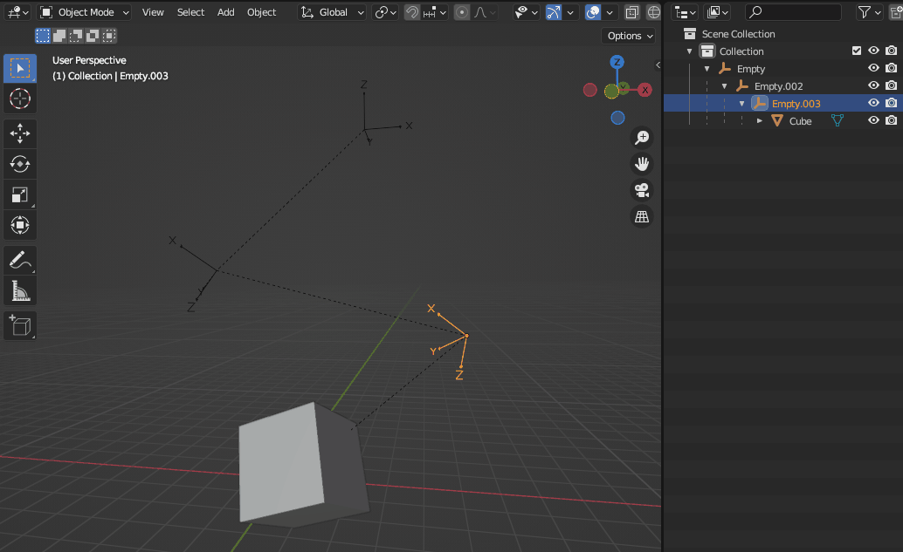
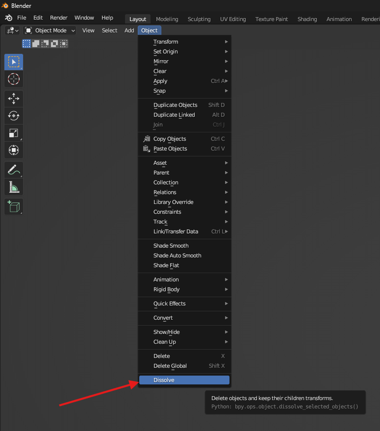
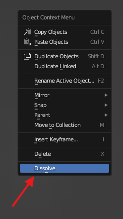
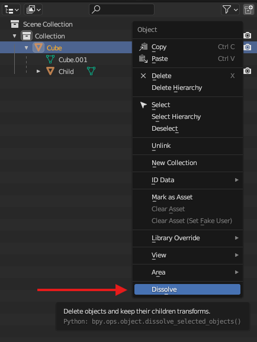

# Blender Add-On: Dissolve Objects

Delete selected objects while preserving their children's transforms and hierarchy by reparenting them to the closest remaining parent.

Useful for editing nested object hierarchies, similar to **Dissolve Bones** for armatures.

Optionally skip objects with sheared transforms to help preserve their visual appearance.

Based on an idea and request by 3D artist Enzo Ducos.

## Compatibility

Blender **3.6 and newer**, including the latest Blender **5.2 LTS** release. 

## Installation

Download the latest `.zip` from the [Releases](../../releases) page, then install it through:

- **Blender 4.2 and newer:**
  Simply **drag and drop** the downloaded `.zip` file directly into the Blender window to install it.
- **Blender 3.6 to 4.1:**
  Go to **Edit → Preferences → Add-ons → Install...** and select the `.zip` file.

## How to use

Select objects you want to delete and launch the tool from:

- **View3D → Object → Dissolve**
  

- **Object Context Menu → Dissolve**
  

- **Outliner Context Menu → Dissolve**

### Tool Options

* **Global Delete**: Completely delete objects from the file instead of only removing them from the hierarchy.
* **Skip Sheared**: Do not delete parents with sheared transforms, or parents whose children have sheared transforms. Deleting such objects may change the visual appearance of their children.
